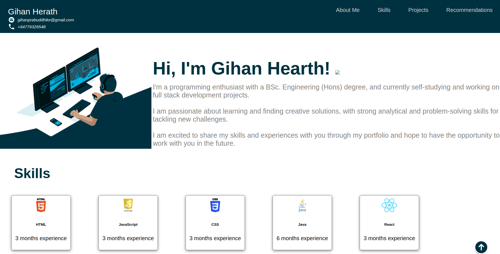

<!-- ABOUT THE PROJECT -->
# <b>Basic Portfolio Webpage</b>




<p>Created a basic Portfolio webpage using HTML, CSS and JavaScript
<br>
</p>

## Built with using

* HTML5 
* CSS3 
* JavScript 


## How to use this repository

* Open the terminal
* Then clone the repo using
```
git clone https://github.com/gihan-herath/Portfolio-Webpage
```


<!-- CONTACT -->
## Contact

Gihan Herath - [@LinkedIn](https://www.linkedin.com/in/gihanpherath/)

Project Link: [Check the repository on GitHub](https://github.com/gihan-herath/Portfolio-Webpage)


<!-- MARKDOWN LINKS & IMAGES -->
<!-- https://www.markdownguide.org/basic-syntax/#reference-style-links -->
